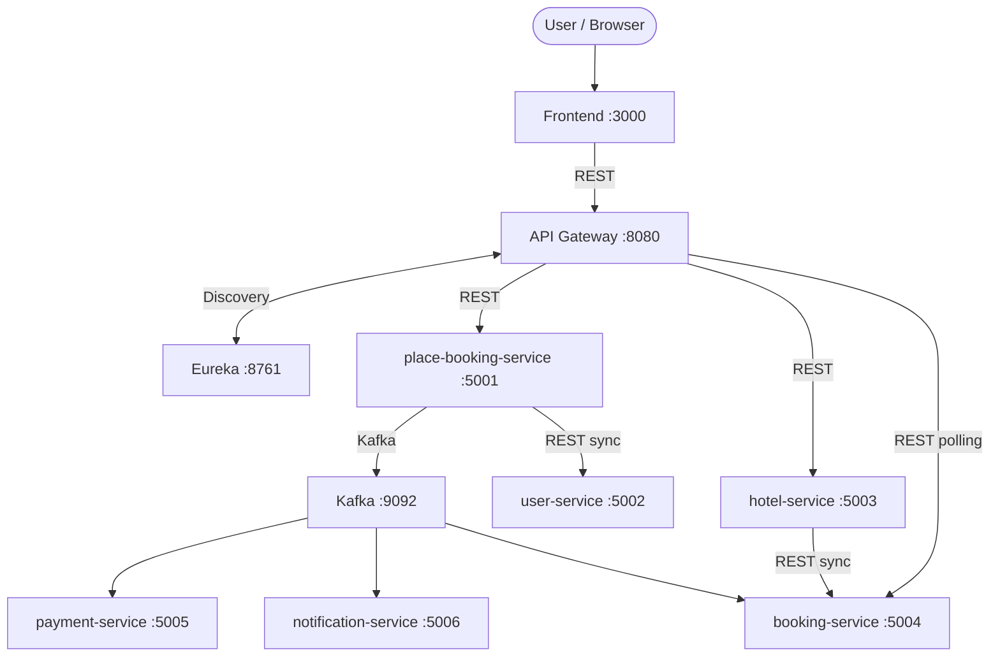

# Dự án microservices tự động hoá quy trình đặt phòng khách sạn 

> Bài tập môn Phát triển phần mềm hướng dịch vụ (SOA/Microservices).
> Mục tiêu: tự động hoá quy trình **đặt phòng khách sạn** theo mô hình microservices với **API Gateway + Eureka Discovery + Kafka Saga**.


---

## Thành viên nhóm

| Họ tên           | Mã SV       | Vai trò                                                                        | Ghi chú |
|------------------|-------------|--------------------------------------------------------------------------------|--------|
| Đoàn Quang Minh  | B22DCCN527  | Phân tích và thiết kế dự án                                                    | ...    |
| | | Phát triển user-service, hotel-service, booking-service, gateway, frontend, eureka server |
| Nguyễn Đức Lâm   | B22DCCN479  | Phân tích và thiết kế dự án                                                    | ...    |
| | | Phát triển place-booking-service, payment-service, notification-service, cài đặt Kafka |

---

## Bài toán & phạm vi

**Domain**: Đặt phòng khách sạn.

**Business Process**: **Place Booking**

Luồng chính:
1. Khách tìm kiếm khách sạn
2. Xem thông tin chi tiết khách sạn và loại phòng
3. Kiểm tra phòng trống theo ngày (check-in / check-out)
4. Tạo booking trạng thái `PENDING`
5. Thanh toán cọc (mock)
6. Thành công → xác nhận `CONFIRMED` + gửi email; thất bại → huỷ `CANCELLED` (compensating)

Tài liệu chi tiết:
- [`docs/analysis-and-design.md`](docs/analysis-and-design.md)
- [`docs/architecture.md`](docs/architecture.md)

---

## Kiến trúc hệ thống

Hệ thống áp dụng các pattern chính:
- **API Gateway** (Spring Cloud Gateway, WebFlux)
- **Service Discovery** (Netflix Eureka)
- **Database per Service** (mỗi service một Postgres riêng)
- **Saga Orchestration** cho luồng đặt phòng (place-booking-service)
- **Event-driven** qua Kafka (command/event topics)

Sơ đồ (tóm tắt):



---

## Thành phần & cổng (ports)

| Thành phần | Trách nhiệm | Công nghệ | Port (host) |
|---|---|---|---:|
| Frontend | UI demo: tìm kiếm/đặt phòng + polling trạng thái | React + Vite | 3000 |
| API Gateway | Entry point, routing, server-side discovery | Spring Cloud Gateway (WebFlux) | 8080 |
| Eureka Server | Service Registry | Spring Cloud Netflix Eureka | 8761 |
| place-booking-service | Saga Orchestrator (Task Service) | Spring Boot | 5001 |
| user-service | Quản lý user/role (Entity Service) | Spring Boot | 5002 |
| hotel-service | Quản lý hotel/room-type + availability | Spring Boot | 5003 |
| booking-service | Quản lý booking + polling status | Spring Boot | 5004 |
| payment-service | Payment mock + circuit breaker | Spring Boot | 5005 |
| notification-service | Gửi email (async) | Spring Boot | 5006 |
| Kafka | Message broker | Kafka + Zookeeper | 9092 |
| user-db | DB cho user-service | PostgreSQL | 5432 |
| hotel-db | DB cho hotel-service | PostgreSQL | 5433 |
| booking-db | DB cho booking-service | PostgreSQL | 5434 |
| payment-db | DB cho payment-service | PostgreSQL | 5435 |

---

## Chạy hệ thống (Docker Compose)

Yêu cầu:
- Docker + Docker Compose

Chạy:

```bash
docker compose up --build
```

> Lưu ý: Các service giao tiếp nội bộ qua DNS của Docker Compose (tên service), **không dùng localhost** bên trong container.

---

## Kiểm tra nhanh (healthchecks)

```bash
curl http://localhost:8761

curl http://localhost:8080/actuator/health

curl http://localhost:5001/health # place-booking-service
curl http://localhost:5002/health # user-service
curl http://localhost:5003/health # hotel-service
curl http://localhost:5004/health # booking-service
curl http://localhost:5005/health # payment-service
curl http://localhost:5006/health # notification-service
```

---

## Tài liệu API (OpenAPI)

Các đặc tả API theo OpenAPI 3.0 nằm trong `docs/api-specs/`:

- [`docs/api-specs/place-booking-service.yaml`](docs/api-specs/place-booking-service.yaml)
- [`docs/api-specs/user-service.yaml`](docs/api-specs/user-service.yaml)
- [`docs/api-specs/hotel-service.yaml`](docs/api-specs/hotel-service.yaml)
- [`docs/api-specs/booking-service.yaml`](docs/api-specs/booking-service.yaml)
- [`docs/api-specs/payment-service.yaml`](docs/api-specs/payment-service.yaml)
- [`docs/api-specs/notification-service.yaml`](docs/api-specs/notification-service.yaml)

---

## Ghi chú triển khai

- Mỗi service đều expose `GET /health` trả về `{"status":"ok"}`.
- Luồng đặt phòng là bất đồng bộ: client gọi `POST /place-booking` và sau đó **polling** `GET /bookings/{bookingId}` đến khi `CONFIRMED` hoặc `CANCELLED`.

---

## License

MIT — xem [`LICENSE`](LICENSE).

