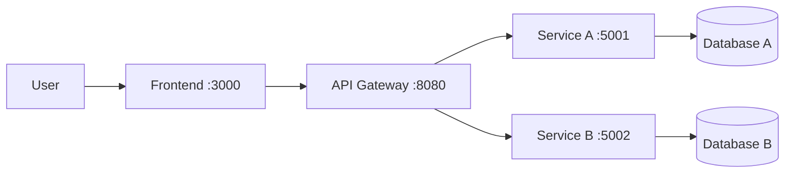

# 🧩 Microservices Assignment Starter Template

This repository is a **starter template** for building a microservices-based system. Use it as a base for your group assignment.

> **Technology-agnostic**: You are free to choose any programming language, framework, or database for each service.

---

## 👥 Team Members

| Name            | Student ID | Role | Contribution |
|-----------------|------------|------|-------------|
| Đoàn Quang Minh | B22DCCN527 | ...  | ...         |
| Nguyễn Đức Lâm  | B22DCCN479 | ...  | ...         |

---

## 📁 Project Structure

```
microservices-assignment-starter/
├── README.md                       # This file — project overview
├── .env.example                    # Environment variable template
├── docker-compose.yml              # Multi-container orchestration
├── Makefile                        # Common development commands
│
├── docs/                           # 📖 Documentation
│   ├── analysis-and-design.md      # System analysis & service design
│   ├── architecture.md             # Architecture overview & diagrams
│   ├── asset/                      # Images, diagrams, visual assets
│   └── api-specs/                  # OpenAPI 3.0 specifications
│       ├── service-a.yaml
│       └── service-b.yaml
│
├── frontend/                       # 🖥️ Frontend application
│   ├── Dockerfile
│   ├── readme.md
│   └── src/
│
├── gateway/                        # 🚪 API Gateway / reverse proxy
│   ├── Dockerfile
│   ├── readme.md
│   └── src/
│
├── services/                       # ⚙️ Backend microservices
│   ├── service-a/
│   │   ├── Dockerfile
│   │   ├── readme.md
│   │   └── src/
│   └── service-b/
│       ├── Dockerfile
│       ├── readme.md
│       └── src/
│
├── scripts/                        # 🔧 Utility scripts
│   └── init.sh
│
├── .ai/                            # 🤖 AI-assisted development
│   ├── AGENTS.md                   # Agent instructions (source of truth)
│   ├── vibe-coding-guide.md        # Hướng dẫn vibe coding
│   └── prompts/                    # Reusable prompt templates
│       ├── new-service.md
│       ├── api-endpoint.md
│       ├── create-dockerfile.md
│       ├── testing.md
│       └── debugging.md
│
├── .github/copilot-instructions.md # GitHub Copilot instructions
├── .cursorrules                    # Cursor AI instructions
├── .windsurfrules                  # Windsurf AI instructions
└── CLAUDE.md                       # Claude Code instructions
```

---

## 🚀 Getting Started

### Prerequisites

- [Docker Desktop](https://docs.docker.com/get-docker/) (includes Docker Compose)
- [Git](https://git-scm.com/)
- An AI coding tool (recommended): [GitHub Copilot](https://github.com/features/copilot), [Cursor](https://cursor.sh), [Windsurf](https://codeium.com/windsurf), or [Claude Code](https://docs.anthropic.com/en/docs/claude-code)

### Quick Start

```bash
# 1. Clone this repository
git clone https://github.com/hungdn1701/microservices-assignment-starter.git
cd microservices-assignment-starter

# 2. Initialize the project
bash scripts/init.sh
# Or manually:
cp .env.example .env

# 3. Build and run all services
docker compose up --build

# 4. Verify services are running
curl http://localhost:8080   # Gateway
curl http://localhost:5001   # Service A
curl http://localhost:5002   # Service B
curl http://localhost:3000   # Frontend
```

### Using Make (optional)

```bash
make help      # Show all available commands
make init      # Initialize project
make up        # Build and start all services
make down      # Stop all services
make logs      # View logs
make clean     # Remove everything
```

---

## 🏗️ Architecture



- **Frontend** → User interface, communicates only with the Gateway
- **Gateway** → Routes requests to appropriate backend services
- **Services** → Independent microservices, each with their own database
- **Communication** → REST APIs over Docker Compose network

> 📖 Full architecture documentation: [`docs/architecture.md`](docs/architecture.md)

---

## 🤖 AI-Assisted Development (Vibe Coding)

This repo is pre-configured for **AI-powered development**. Each AI tool auto-loads its instruction file:

| Tool | Config File |
|------|-------------|
| GitHub Copilot | `.github/copilot-instructions.md` |
| Cursor | `.cursorrules` |
| Claude Code | `CLAUDE.md` |
| Windsurf | `.windsurfrules` |

All instruction files point to [`.ai/AGENTS.md`](.ai/AGENTS.md) as the single source of truth.
Ready-to-use prompt templates are in [`.ai/prompts/`](.ai/prompts/).

> 📖 Full guide (Vietnamese): [`.ai/vibe-coding-guide.md`](.ai/vibe-coding-guide.md)

---

## 📋 Recommended Workflow

### Phase 1: Analysis & Design
- [ ] Read and understand this starter template
- [ ] Choose your business domain and use case
- [ ] Document analysis in [`docs/analysis-and-design.md`](docs/analysis-and-design.md)
- [ ] Design system architecture in [`docs/architecture.md`](docs/architecture.md)

### Phase 2: API Design
- [ ] Define APIs using OpenAPI 3.0 in [`docs/api-specs/`](docs/api-specs/)
- [ ] Include all endpoints, request/response schemas
- [ ] Review API design with the team

### Phase 3: Implementation
- [ ] Choose tech stack for each service (can be different per service!)
- [ ] Update Dockerfiles for each service
- [ ] Implement `GET /health` endpoint in every service
- [ ] Implement business logic and API endpoints
- [ ] Configure API Gateway routing
- [ ] Build frontend UI

### Phase 4: Testing & Documentation
- [ ] Write unit and integration tests
- [ ] Verify `docker compose up --build` starts everything
- [ ] Update service `readme.md` files
- [ ] Update this `README.md` with your project details

---

## 🧪 Development Guidelines

- **Health checks**: Every service MUST expose `GET /health` → `{"status": "ok"}`
- **Environment**: Use `.env` for configuration, never hardcode secrets
- **Networking**: Services communicate via Docker Compose DNS (use service names, not `localhost`)
- **API specs**: Keep OpenAPI specs in sync with implementation
- **Git workflow**: Use branches, write meaningful commit messages, commit often

---

## 👩‍🏫 Assignment Submission Checklist

- [ ] `README.md` updated with team info, service descriptions, and usage instructions
- [ ] All services start with `docker compose up --build`
- [ ] Every service has a working `GET /health` endpoint
- [ ] API documentation complete in `docs/api-specs/`
- [ ] Architecture documented in `docs/architecture.md`
- [ ] Analysis and design documented in `docs/analysis-and-design.md`
- [ ] Each service has its own `readme.md`
- [ ] Code is clean, organized, and follows chosen language conventions
- [ ] Tests are included and passing

---

## Author

This template was created by **Hung Dang**.
- Email: hungdn@ptit.edu.vn
- GitHub: [hungdn1701](https://github.com/hungdn1701)

Good luck! 💪🚀

