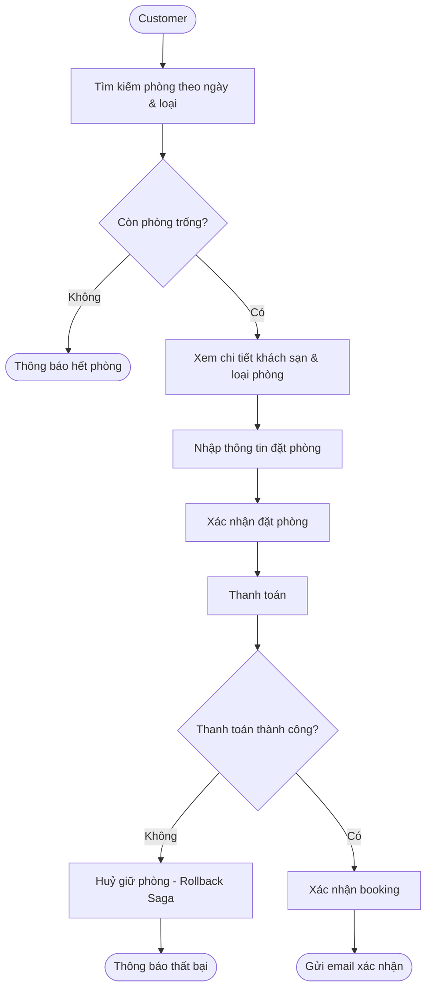
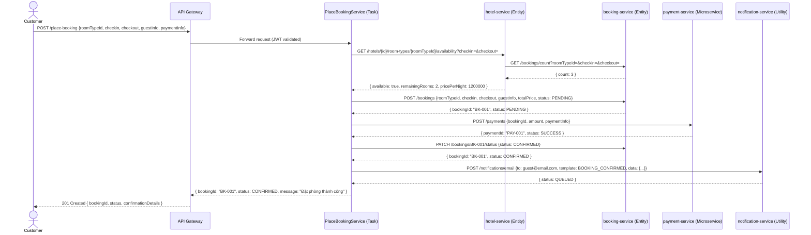
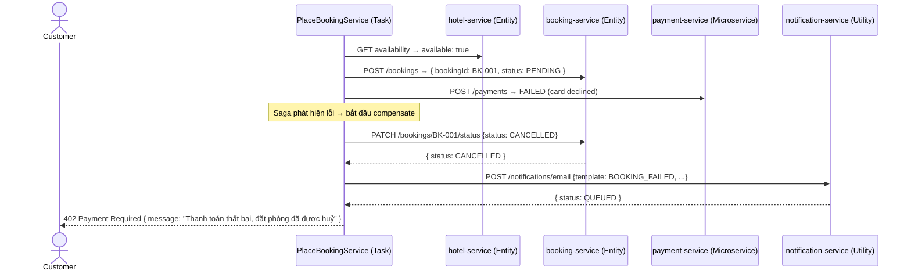
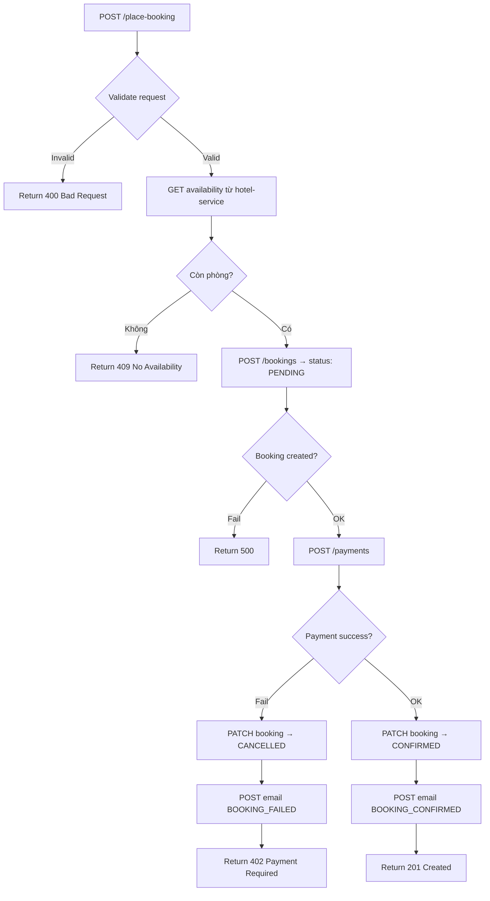
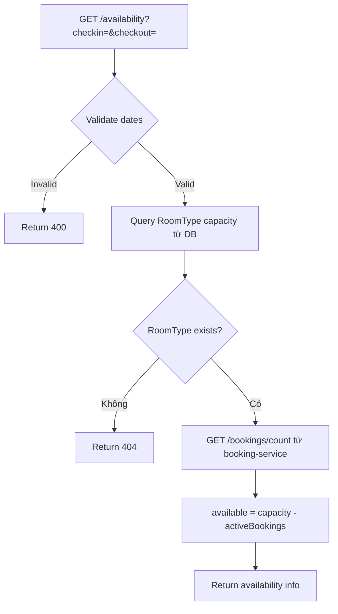
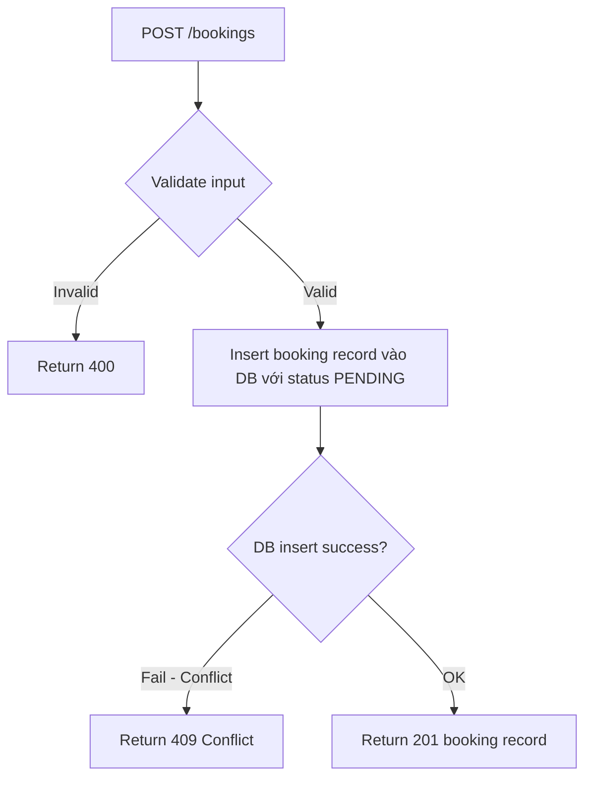
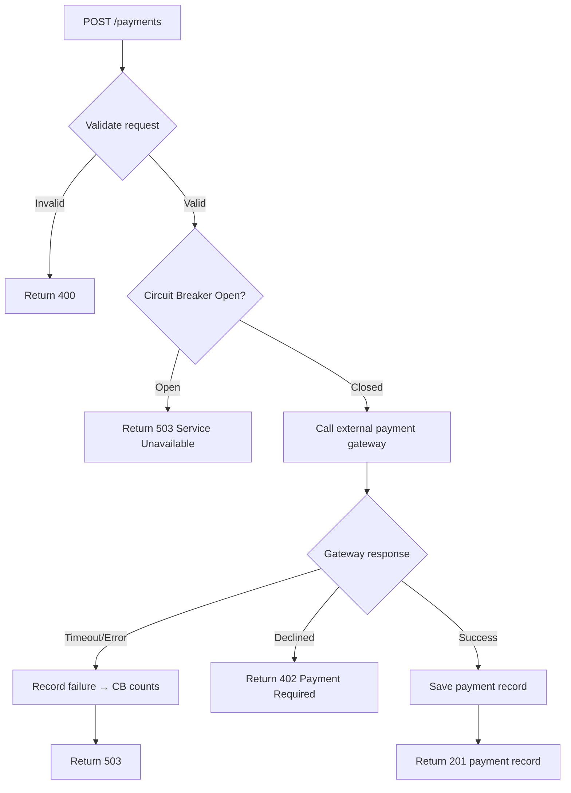
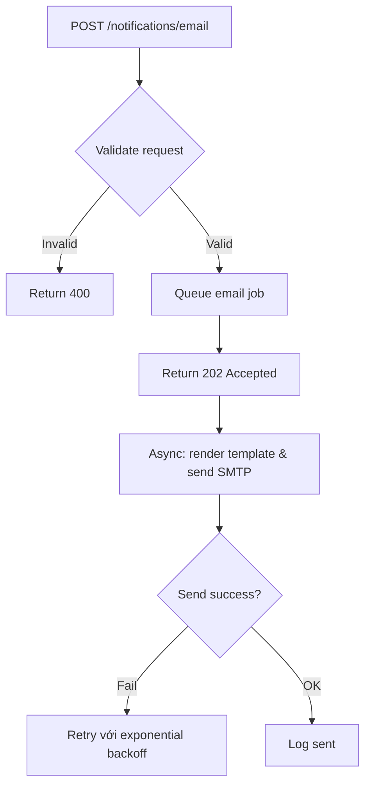

# Analysis and Design — Business Process Automation Solution

> **Goal**: Analyze a specific business process and design a service-oriented automation solution (SOA/Microservices).
> Scope: 4–6 week assignment — focus on **one business process**, not an entire system.

**References:**
1. *Service-Oriented Architecture: Analysis and Design for Services and Microservices* — Thomas Erl (2nd Edition)
2. *Microservices Patterns: With Examples in Java* — Chris Richardson
3. *Bài tập — Phát triển phần mềm hướng dịch vụ* — Hung Dang (available in Vietnamese)

---

## Part 1 — Analysis Preparation

### 1.1 Business Process Definition

- **Domain**: Hotel Booking System (Hệ thống đặt phòng khách sạn)
- **Business Process**: Place Booking — Khách hàng tìm kiếm phòng khách sạn theo tiêu chí (ngày check-in, check-out, loại phòng), xem thông tin chi tiết, thực hiện đặt phòng và thanh toán tiền cọc, nhận xác nhận qua email.
- **Actors**:
  - **Customer** — tìm kiếm khách sạn, xem chi tiết phòng, đặt phòng, thanh toán tiền cọc
  - **System (PlaceBookingService)** — điều phối toàn bộ luồng đặt phòng giữa các services
- **Scope**:

| In Scope | Out of Scope |
|----------|--------------|
| Tìm kiếm phòng theo ngày và loại phòng | Chọn phòng cụ thể theo số phòng |
| Xem thông tin chi tiết khách sạn và loại phòng | Quản lý check-in / check-out |
| Đặt phòng và giữ chỗ có timeout | Loyalty points / chương trình khách hàng thân thiết |
| Thanh toán (mock) và nhận xác nhận email | Tích hợp kênh phân phối ngoài (Booking.com, Agoda) |
| Saga rollback khi thanh toán thất bại | Quản lý nhân viên khách sạn |
| Circuit Breaker cho payment service | Mobile application |

**Process Diagram:**

---

### 1.2 Existing Automation Systems

None — the process is currently performed manually.

---

### 1.3 Non-Functional Requirements

Non-functional requirements serve as input for identifying Utility Service and Microservice Candidates in step 2.7.

| Requirement  | Description |
|--------------|-------------|
| Performance  | Availability check trả về kết quả trong < 300ms. Booking confirmation hoàn thành trong < 2s trong điều kiện bình thường. |
| Security     | JWT authentication tại API Gateway cho mọi request. Payment service được isolate hoàn toàn, không expose trực tiếp ra ngoài. Input validation trên tất cả endpoints. |
| Scalability  | Hotel-service và booking-service có thể scale độc lập khi traffic tăng (ví dụ mùa lễ tết). Payment-service scale riêng khi số lượng giao dịch tăng. |
| Availability | Booking flow vẫn hoạt động khi notification-service gián đoạn (email gửi bất đồng bộ). Circuit Breaker trên payment-service ngăn cascading failure khi payment gateway chậm. |
| Consistency  | Không được oversell — đảm bảo số booking trong khoảng thời gian không vượt quá số lượng phòng của từng loại. Saga pattern đảm bảo rollback khi bất kỳ bước nào thất bại. |

---

## Part 2 — REST/Microservices Modeling

### 2.1 Decompose Business Process & 2.2 Filter Unsuitable Actions

Decompose the Place Booking process into granular actions và đánh giá khả năng encapsulate thành service.

| # | Action | Actor | Description | Suitable? |
|---|--------|-------|-------------|-----------|
| 1 | Search hotels by criteria | Customer | Tìm kiếm khách sạn theo ngày check-in, check-out hoặc tên khách sạn, địa điểm | ✅ |
| 2 | Check room availability | System | Kiểm tra số phòng còn trống: đếm booking hiện tại trong khoảng thời gian, so với capacity của loại phòng | ✅ |
| 3 | View hotel details | Customer | Xem thông tin chi tiết khách sạn, ảnh, mô tả loại phòng, giá | ✅ |
| 4 | View room type details | Customer | Xem chi tiết loại phòng: tiện nghi, sức chứa, giá mỗi đêm | ✅ |
| 5 | Calculate total price | System | Tính tổng giá = số đêm × giá mỗi đêm của loại phòng | ✅ |
| 6 | Create booking record | System | Tạo bản ghi booking với trạng thái PENDING, lưu thông tin khách và phòng | ✅ |
| 7 | Update booking status | System | Cập nhật trạng thái booking (PENDING → CONFIRMED / CANCELLED) | ✅ |
| 8 | Get booking by ID | Customer/System | Truy vấn thông tin booking theo ID | ✅ |
| 9 | Process payment | System | Thực hiện charge thẻ của khách hàng qua payment gateway | ✅ |
| 10 | Refund payment | System | Hoàn tiền khi booking bị huỷ do lỗi (compensating transaction) | ✅ |
| 11 | Send confirmation email | System | Gửi email xác nhận đặt phòng thành công cho khách hàng | ✅ |
| 12 | Send cancellation email | System | Gửi email thông báo huỷ phòng khi Saga rollback | ✅ |
| 13 | Physical room inspection | Staff | Nhân viên kiểm tra phòng trước khi khách nhận phòng | ❌ |

> Actions ❌: Yêu cầu phán đoán của con người, không thể encapsulate thành service tự động.

---

### 2.3 Entity Service Candidates

Identify business entities và group các **agnostic actions** (có thể tái sử dụng ở nhiều business process khác) vào Entity Service Candidates.

| Entity | Service Candidate | Agnostic Actions | Lý do Agnostic |
|--------|-------------------|------------------|----------------|
| Hotel, RoomType | **hotel-service** | Search hotels (action 1), Check availability (action 2), View hotel details (action 3), View room type details (action 4), Calculate total price (action 5) | Thông tin khách sạn và phòng có thể được dùng bởi báo cáo doanh thu, quản lý nội bộ, gợi ý phòng — không gắn với riêng luồng đặt phòng |
| Booking | **booking-service** | Create booking record (action 6), Update booking status (action 7), Get booking by ID (action 8), Get booking history (action 9) | Booking data được dùng bởi báo cáo, thống kê, lịch sử — không gắn với riêng một process |

> **Lưu ý thiết kế — Availability Check:** `Check availability` (action 2) nằm trong hotel-service vì hotel-service sở hữu thông tin `capacity` của từng loại phòng. Để tính phòng còn trống, hotel-service gọi booking-service lấy số lượng booking hiện tại trong khoảng thời gian tương ứng (`GET /bookings/count?roomTypeId=&checkin=&checkout=`), sau đó tự tính: `available = capacity - activeBookings`.

---

### 2.4 Task Service Candidate

Group các **non-agnostic actions** — đặc thù của luồng Place Booking, không tái sử dụng được — vào Task Service Candidate.

| Non-agnostic Action | Task Service Candidate | Lý do Non-agnostic |
|---------------------|------------------------|---------------------|
| Orchestrate toàn bộ booking flow (check → create → pay → confirm) | **PlaceBookingService** | Chỉ có ý nghĩa trong luồng "đặt phòng". Nếu bỏ luồng này, orchestration logic vô nghĩa |
| Quản lý Saga state machine (PENDING → CONFIRMED / CANCELLED) | **PlaceBookingService** | Business rules về state transition gắn chặt với luồng đặt phòng cụ thể |
| Compensating transaction — rollback khi payment fail | **PlaceBookingService** | Logic rollback (cancel booking + refund) chỉ tồn tại trong context của luồng này |
| Booking timeout — tự động huỷ nếu không thanh toán trong 15 phút | **PlaceBookingService** | Rule "15 phút" là business rule đặc thù của process đặt phòng này |

---

### 2.5 Identify Resources

Map entities và processes sang REST URI Resources.

| Entity / Process | Resource URI | Owned By |
|------------------|--------------|----------|
| Hotel | `/hotels` | hotel-service |
| Hotel (cụ thể) | `/hotels/{hotelId}` | hotel-service |
| RoomType của Hotel | `/hotels/{hotelId}/room-types` | hotel-service |
| RoomType (cụ thể) | `/hotels/{hotelId}/room-types/{roomTypeId}` | hotel-service |
| Availability của RoomType | `/hotels/{hotelId}/room-types/{roomTypeId}/availability` | hotel-service |
| Booking | `/bookings` | booking-service |
| Booking (cụ thể) | `/bookings/{bookingId}` | booking-service |
| Booking count (dùng nội bộ) | `/bookings/count` | booking-service |
| Place Booking process | `/place-booking` | PlaceBookingService |
| Payment | `/payments` | payment-service |
| Notification | `/notifications/email` | notification-service |

---

### 2.6 Associate Capabilities with Resources and Methods

| Service Candidate | Capability | Resource | HTTP Method |
|-------------------|------------|----------|-------------|
| **hotel-service** | Search hotels by criteria | `/hotels` | GET |
| **hotel-service** | Get hotel details | `/hotels/{hotelId}` | GET |
| **hotel-service** | List room types of hotel | `/hotels/{hotelId}/room-types` | GET |
| **hotel-service** | Get room type details | `/hotels/{hotelId}/room-types/{roomTypeId}` | GET |
| **hotel-service** | Check room availability | `/hotels/{hotelId}/room-types/{roomTypeId}/availability?checkin=&checkout=` | GET |
| **booking-service** | Create booking record | `/bookings` | POST |
| **booking-service** | Get booking by ID | `/bookings/{bookingId}` | GET |
| **booking-service** | Update booking status | `/bookings/{bookingId}/status` | PATCH |
| **booking-service** | Get booking history of guest | `/bookings?guestEmail=` | GET |
| **booking-service** | Count active bookings (internal) | `/bookings/count?roomTypeId=&checkin=&checkout=` | GET |
| **PlaceBookingService** | Initiate place booking flow | `/place-booking` | POST |
| **payment-service** | Process payment | `/payments` | POST |
| **payment-service** | Refund payment | `/payments/{paymentId}/refund` | POST |
| **notification-service** | Send email | `/notifications/email` | POST |

---

### 2.7 Utility Service & Microservice Candidates

Based on NFRs (1.3) và processing requirements, identify cross-cutting utility logic hoặc logic cần autonomy đặc biệt.

| Candidate | Type | Justification |
|-----------|------|---------------|
| **notification-service** | Utility Service | Gửi email là technical capability dùng chung — không gắn với domain khách sạn hay đặt phòng. Bất kỳ service nào trong hệ thống cũng có thể gọi (payment xác nhận, booking huỷ, v.v.). Được gọi bất đồng bộ (fire & forget) để không block booking flow (NFR: Availability). |
| **payment-service** | Microservice | Tách ra vì 3 NFR đặc thù: (1) **Resilience** — cần Circuit Breaker riêng vì phụ thuộc external payment gateway, nếu gateway chậm không được kéo cả hệ thống chậm; (2) **Security** — cần isolation hoàn toàn, không service nào khác trực tiếp xử lý thông tin thẻ; (3) **Scalability** — có thể scale độc lập khi số lượng giao dịch tăng đột biến mà không cần scale hotel hay booking service. |

---

### 2.8 Service Composition Candidates

Interaction diagram cho luồng Place Booking — bao gồm cả happy path và Saga compensating flow.

**Happy Path:**

**Saga Compensating Flow — Payment Fails:**

---

## Part 3 — Service-Oriented Design

### 3.1 Uniform Contract Design

Full OpenAPI specs:
- [`docs/api-specs/hotel-service.yaml`](api-specs/hotel-service.yaml)
- [`docs/api-specs/booking-service.yaml`](api-specs/booking-service.yaml)
- [`docs/api-specs/place-booking-service.yaml`](api-specs/place-booking-service.yaml)
- [`docs/api-specs/payment-service.yaml`](api-specs/payment-service.yaml)
- [`docs/api-specs/notification-service.yaml`](api-specs/notification-service.yaml)

**hotel-service (Entity Service):**

| Endpoint | Method | Media Type | Response Codes |
|----------|--------|------------|----------------|
| `/health` | GET | application/json | 200 |
| `/hotels` | GET | application/json | 200 |
| `/hotels/{hotelId}` | GET | application/json | 200, 404 |
| `/hotels/{hotelId}/room-types` | GET | application/json | 200, 404 |
| `/hotels/{hotelId}/room-types/{roomTypeId}` | GET | application/json | 200, 404 |
| `/hotels/{hotelId}/room-types/{roomTypeId}/availability` | GET | application/json | 200, 400, 404 |

**booking-service (Entity Service):**

| Endpoint | Method | Media Type | Response Codes |
|----------|--------|------------|----------------|
| `/health` | GET | application/json | 200 |
| `/bookings` | POST | application/json | 201, 400, 409 |
| `/bookings` | GET | application/json | 200 |
| `/bookings/count` | GET | application/json | 200, 400 |
| `/bookings/{bookingId}` | GET | application/json | 200, 404 |
| `/bookings/{bookingId}/status` | PATCH | application/json | 200, 400, 404 |

**PlaceBookingService (Task Service):**

| Endpoint | Method | Media Type | Response Codes |
|----------|--------|------------|----------------|
| `/health` | GET | application/json | 200 |
| `/place-booking` | POST | application/json | 201, 400, 402, 409, 503 |

**payment-service (Microservice):**

| Endpoint | Method | Media Type | Response Codes |
|----------|--------|------------|----------------|
| `/health` | GET | application/json | 200 |
| `/payments` | POST | application/json | 201, 400, 402, 503 |
| `/payments/{paymentId}/refund` | POST | application/json | 200, 404, 503 |

**notification-service (Utility Service):**

| Endpoint | Method | Media Type | Response Codes |
|----------|--------|------------|----------------|
| `/health` | GET | application/json | 200 |
| `/notifications/email` | POST | application/json | 202, 400 |

---

### 3.2 Service Logic Design

**PlaceBookingService — Saga Orchestration Flow:**

**hotel-service — Availability Check Flow:**

**booking-service — Create Booking Flow:**

**payment-service — Process Payment Flow:**

**notification-service — Send Email Flow:**

