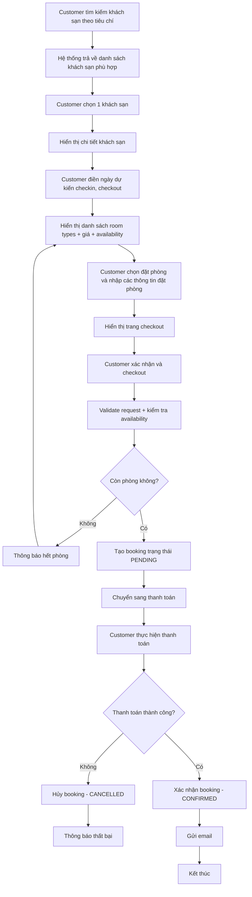
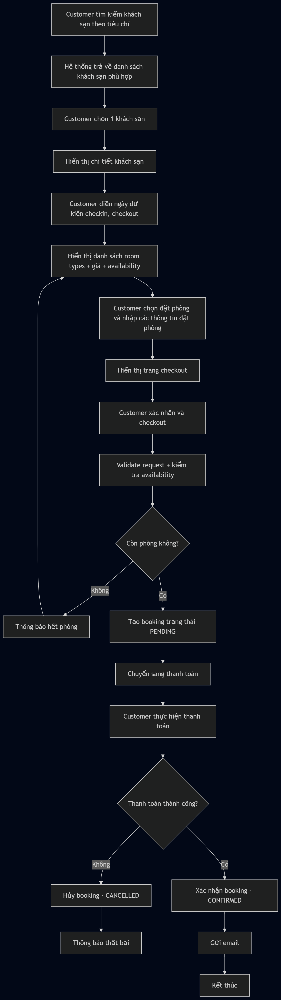
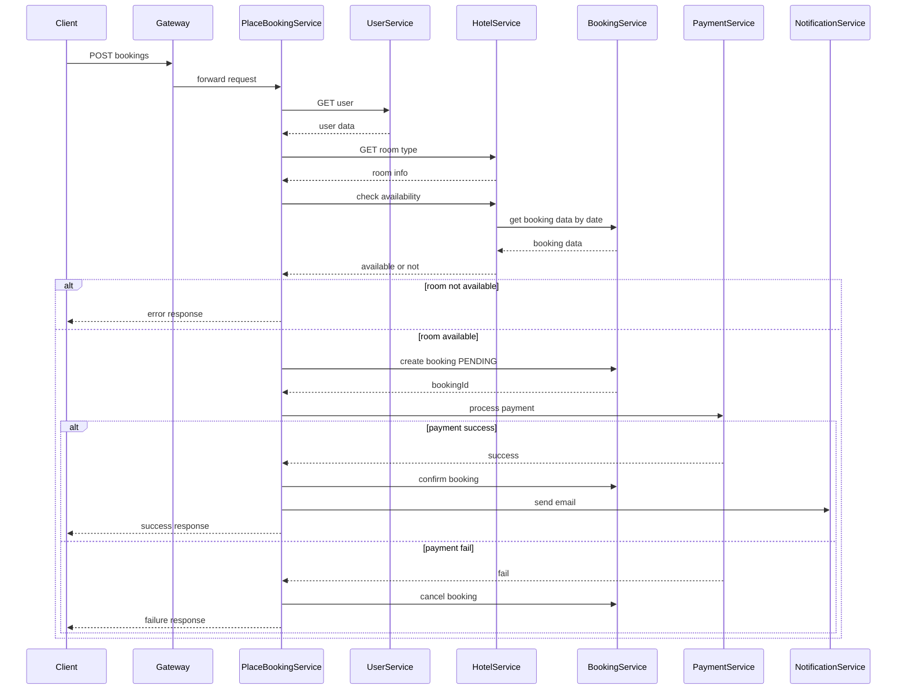
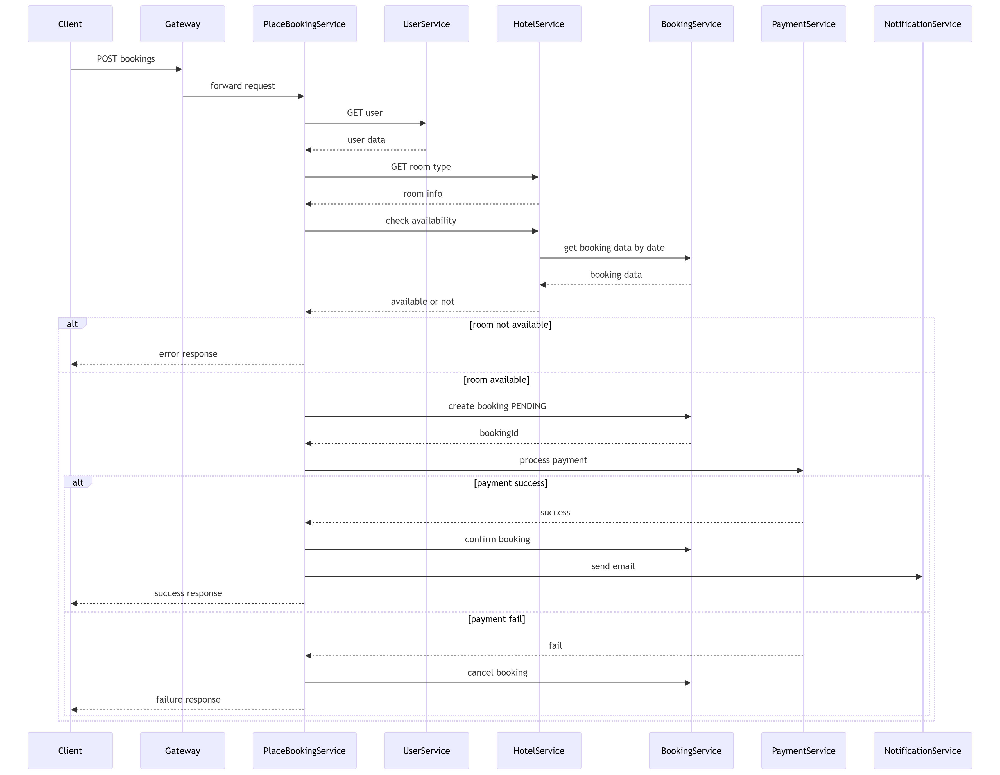
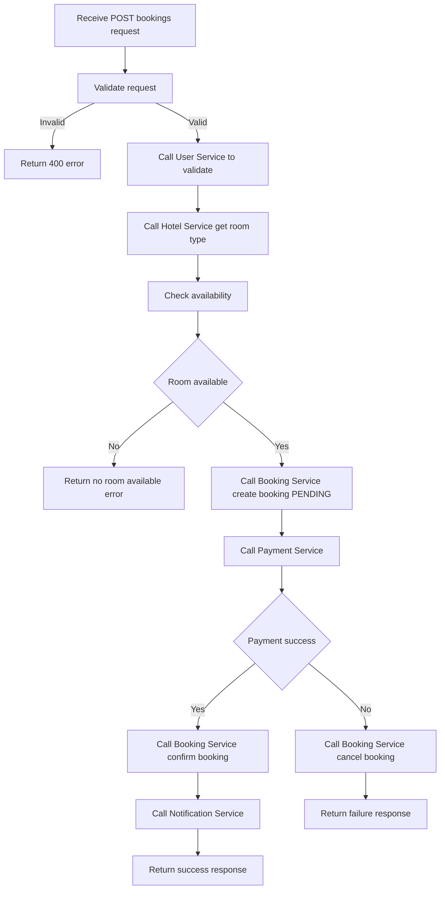
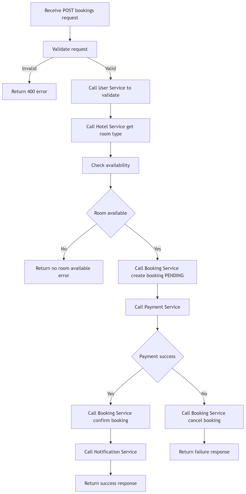
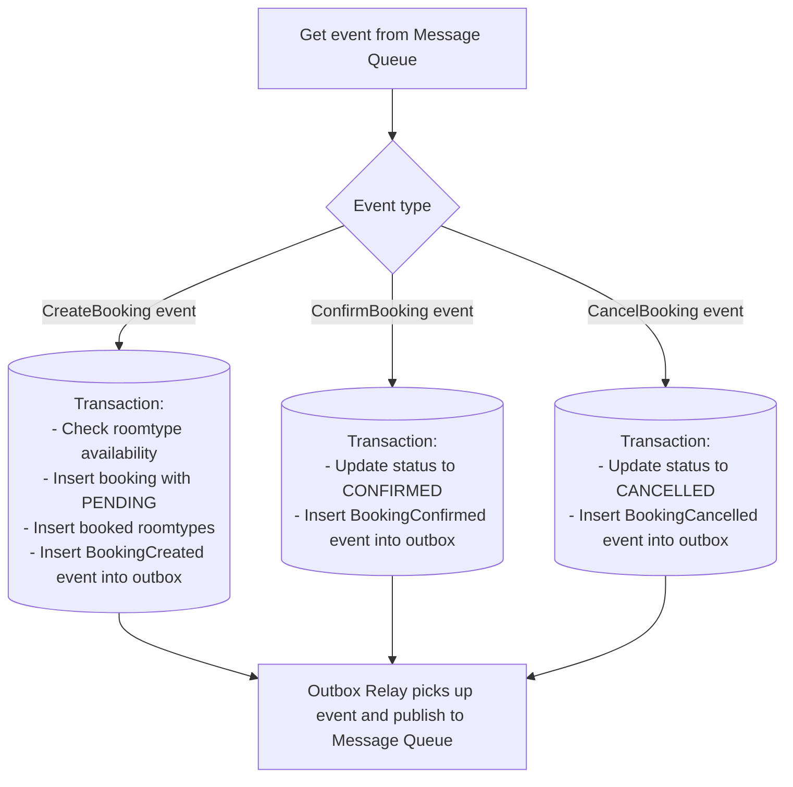
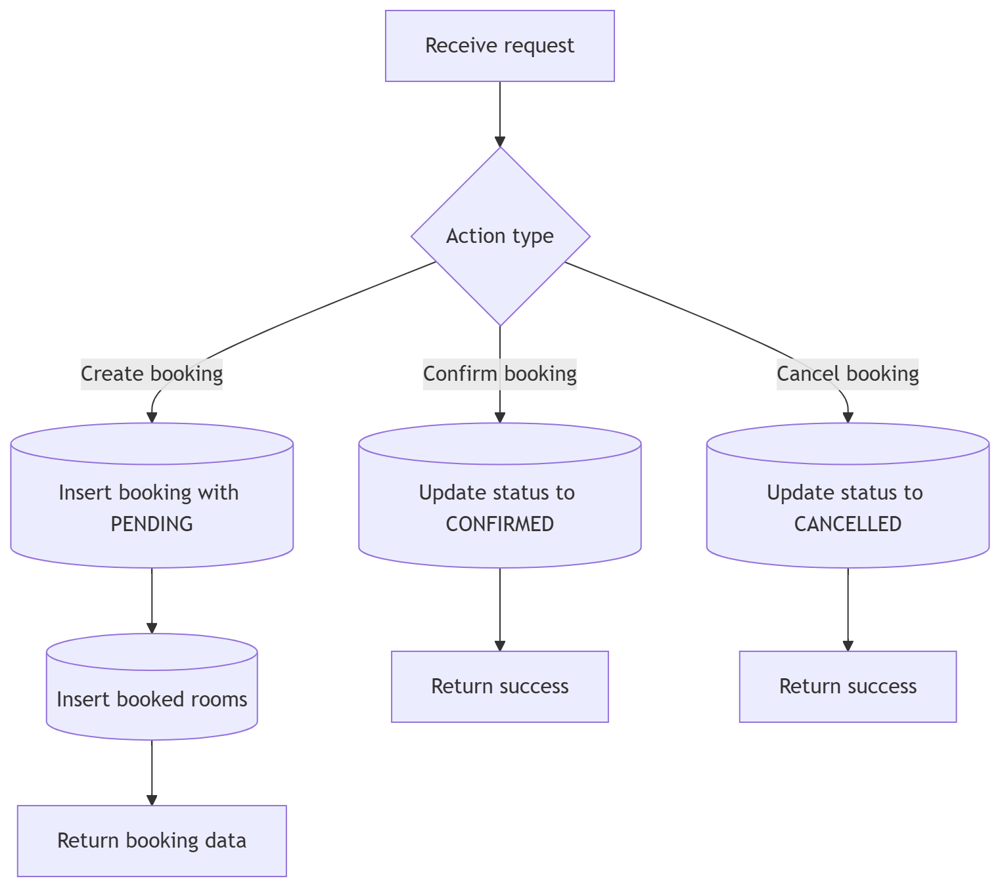
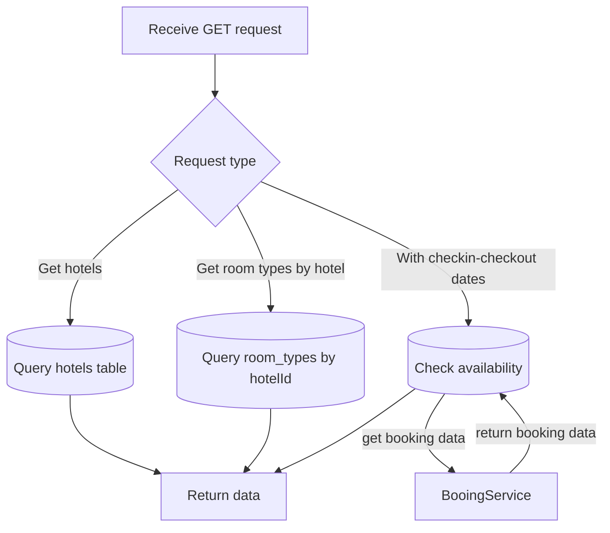
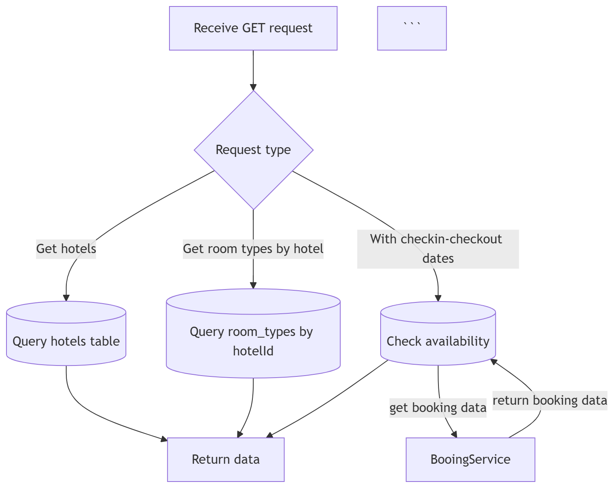

# Analysis and Design — Business Process Automation Solution

> **Goal**: Analyze a specific business process and design a service-oriented automation solution (SOA/Microservices).
> Scope: 4–6 week assignment — focus on **one business process**, not an entire system.

**References:**
1. *Service-Oriented Architecture: Analysis and Design for Services and Microservices* — Thomas Erl (2nd Edition)
2. *Microservices Patterns: With Examples in Java* — Chris Richardson
3. *Bài tập — Phát triển phần mềm hướng dịch vụ* — Hung Dang (available in Vietnamese)

---

## Part 1 — Analysis Preparation

### 1.1 Business Process Definition

Describe or diagram the high-level Business Process to be automated.

- **Domain**: Hệ thống đặt phòng khách sạn
- **Business Process**: Place Booking — Khách hàng tìm kiếm phòng khách sạn theo tiêu chí (ngày check-in, check-out, loại phòng), xem thông tin chi tiết, thực hiện đặt phòng và thanh toán tiền cọc, nhận xác nhận qua email.
- **Actors**: Customer - tìm kiếm khách sạn, xem chi tiết phòng, đặt phòng, thanh toán tiền cọc
- **Scope**:

  | In Scope                                       | Out of Scope                                        |
    |------------------------------------------------|-----------------------------------------------------|
  | Tìm kiếm khách sạn theo tên và địa chỉ         | Chọn phòng cụ thể theo số phòng                     |
  | Xem thông tin chi tiết khách sạn và loại phòng | Quản lý check-in / check-out                        |
  | Đặt phòng và giữ chỗ có timeout                | Loyalty points / chương trình khách hàng thân thiết |
  | Thanh toán (mock) và nhận xác nhận email       | Tích hợp kênh phân phối ngoài (Booking.com, Agoda)  |
  | Saga rollback khi thanh toán thất bại          | Quản lý nhân viên khách sạn                         |
  | Circuit Breaker cho payment service            | Quản lý huỷ phòng sau khi đặt xong                  |

**Process Diagram:**

*(Insert BPMN, flowchart, or image into `docs/asset/` and reference here)*

 
   
  Place Booking Process Flowchart

### 1.2 Existing Automation Systems

List existing systems, databases, or legacy logic related to this process.

| System Name | Type | Current Role | Interaction Method |
|-------------|------|--------------|-------------------|
|             |      |              |                   |
None — the process is currently performed manually.
> If none exist, state: *"None — the process is currently performed manually."*

### 1.3 Non-Functional Requirements

Non-functional requirements serve as input for identifying Utility Service and Microservice Candidates in step 2.7.

| Requirement  | Description                                                                                                                                                                  |
|--------------|------------------------------------------------------------------------------------------------------------------------------------------------------------------------------|
| Performance  | Availability check trả về kết quả trong < 300ms. Booking confirmation hoàn thành trong < 2s trong điều kiện bình thường.                                                     |
| Security     | JWT authentication tại API Gateway cho mọi request. Payment service được isolate hoàn toàn, không expose trực tiếp ra ngoài. Input validation trên tất cả endpoints.         |
| Scalability  | Hotel-service và booking-service có thể scale độc lập khi traffic tăng (ví dụ mùa lễ tết). Payment-service scale riêng khi số lượng giao dịch tăng.                          |
| Availability | Booking flow vẫn hoạt động khi notification-service gián đoạn (email gửi bất đồng bộ). Circuit Breaker trên payment-service ngăn cascading failure khi payment gateway chậm. |
| Consistency  | Không được oversell — đảm bảo số booking trong khoảng thời gian không vượt quá số lượng phòng của từng loại. Saga pattern đảm bảo rollback khi bất kỳ bước nào thất bại.     |

---

## Part 2 — REST/Microservices Modeling

### 2.1 Decompose Business Process & 2.2 Filter Unsuitable Actions

Decompose the process from 1.1 into granular actions. Mark actions unsuitable for service encapsulation.

| #  | Action                    | Actor           | Description                                                                                              | Suitable? |
|----|---------------------------|-----------------|----------------------------------------------------------------------------------------------------------|-----------|
| 1  | Search hotels by criteria | Customer        | Tìm kiếm khách sạn theo tên, địa chỉ                                                                     | ✅         |
| 2  | View hotel details        | Customer        | Xem thông tin chi tiết khách sạn, ảnh, mô tả loại phòng, giá                                             | ✅         |
| 3  | Check room availability   | System          | Kiểm tra số phòng còn trống: đếm booking hiện tại trong khoảng thời gian, so với capacity của loại phòng | ✅         |
| 4  | View room type details    | Customer        | Xem chi tiết loại phòng: tiện nghi, sức chứa, giá mỗi đêm                                                | ✅         |
| 5  | Calculate total price     | System          | Tính tổng giá = số đêm × giá mỗi đêm của loại phòng                                                      | ✅         |
| 6  | Create booking record     | System          | Tạo bản ghi booking với trạng thái PENDING, lưu thông tin khách, khách sạn và phòng đặt                  | ✅         |
| 7  | Update booking status     | System          | Cập nhật trạng thái booking (PENDING → CONFIRMED / CANCELLED)                                            | ✅         |
| 8  | Get booking by ID         | Customer/System | Truy vấn thông tin booking theo ID                                                                       | ✅         |
| 9  | Process payment           | System          | Thực hiện charge thẻ của khách hàng qua payment gateway                                                  | ✅         |
| 10 | Refund payment            | System          | Hoàn tiền khi booking bị huỷ do lỗi (compensating transaction)                                           | ✅         |
| 11 | Send confirmation email   | System          | Gửi email xác nhận đặt phòng thành công cho khách hàng                                                   | ✅         |
| 12 | Send cancellation email   | System          | Gửi email thông báo huỷ phòng khi Saga rollback                                                          | ✅         |
| 13 | Physical room inspection  | Staff           | Nhân viên kiểm tra phòng trước khi khách nhận phòng                                                      | ❌         |

> Actions marked ❌: manual-only, require human judgment, or cannot be encapsulated as a service.

### 2.3 Entity Service Candidates

Identify business entities and group reusable (agnostic) actions into Entity Service Candidates.

| Entity                   | Service Candidate | Agnostic Actions                                               |
|--------------------------|-------------------|----------------------------------------------------------------|
| User, Role               | User-service      | get user                                                       |
| Hotel                    | Hotel-service     | get list hotels, get hotel                                     |
| room_type                | Hotel-service     | get room type by hotel, get room type detail                   |
| Booking                  | Booking-service   | get booking, save booking, update booking, get booking by user |

### 2.4 Task Service Candidate

Group process-specific (non-agnostic) actions into a Task Service Candidate.

| Non-agnostic Action | Task Service Candidate |
|---------------------|------------------------|
| Booking placement   | PlaceBookingService    |

### 2.5 Identify Resources

Map entities/processes to REST URI Resources.

| Entity / Process            | Resource URI                              |
|-----------------------------|-------------------------------------------|
| User                        | /users/                                   |
| Hotel                       | /hotels/                                  |
| Hotel (cụ thể)              | /hotels/{hotelId}                         |
| RoomType của Hotel          | /hotels/{hotelId}/room-types              |
| RoomType (cụ thể)           | /hotels/{hotelId}/room-types/{roomTypeId} |
| Booking                     | /bookings/                                |
| Booking (cụ thể)            | /bookings/{bookingId}                     |
| Booking count (dùng nội bộ) | /bookings/count                           |
| Place Booking process       | /place-booking                            |
| Payment                     | /payments                                 |
| Notification                | /notifications/email                      |

### 2.6 Associate Capabilities with Resources and Methods

| Service Candidate    | Capability                           | Resource                                        | HTTP Method |
|----------------------|--------------------------------------|-------------------------------------------------|-------------|
| User-service         | save user                            | /users/                                         | POST        |
| User-service         | get user                             | /users/{userId}                                 | GET         |
| Hotel-service        | get list hotels                      | /hotels/                                        | GET         |
| Hotel-service        | get hotel                            | /hotels/{hotelId}                               | GET         |
| Hotel-service        | get room type                        | /hotels/{hotelId}/room-types                    | GET         |
| Hotel-service        | get room type availability           | /hotels/{hotelId}/room-types?checkin=&checkout= | GET         |
| Hotel-service        | get room type                        | /hotels/{hotelId}/room-types/{room-typeId}      | GET         |
| Booking-service      | get booking                          | /bookings/{bookingId}                           | GET         |
| Booking-service      | save booking                         | /bookings                                       | POST        |
| booking-service      | Update booking status                | /bookings/{bookingId}/status                    | PATCH       |
| Booking-service      | Count booking room type availability | /bookings/count?roomTypeId=&checkin=&checkout=  | GET         |
| Booking-service      | get booking by user id               | /bookings?userId=                               | GET         |
| PlaceBookingService  | Initiate place booking flow          | /place-booking                                  | POST        |
| Payment-service      | process payment                      | /payments                                       | POST        |
| Payment-service      | Refund payment                       | /payments/{paymentId}/refund                    | POST        |
| Notification-service | Send email                           | /notifications/email                            | POST        |

### 2.7 Utility Service & Microservice Candidates

Based on Non-Functional Requirements (1.3) and Processing Requirements, identify cross-cutting utility logic or logic requiring high autonomy/performance.

| Candidate            | Type (Utility / Microservice) | Justification                                                                                                                                                                                                                                                                                                                                                                         |
|----------------------|-------------------------------|---------------------------------------------------------------------------------------------------------------------------------------------------------------------------------------------------------------------------------------------------------------------------------------------------------------------------------------------------------------------------------------|
| Notification-service | Utility Service               | Gửi email là technical capability dùng chung — không gắn với domain khách sạn hay đặt phòng. Bất kỳ service nào trong hệ thống cũng có thể gọi (payment xác nhận, booking huỷ, v.v.). Được gọi bất đồng bộ (fire & forget) để không block booking flow (NFR: Availability).                                                                                                           |
| Payment-service      | Microservice                  | Tách ra vì 3 NFR đặc thù: (1) Resilience — cần Circuit Breaker riêng vì phụ thuộc external payment gateway, nếu gateway chậm không được kéo cả hệ thống chậm; (2) Security — cần isolation hoàn toàn, không service nào khác trực tiếp xử lý thông tin thẻ; (3) Scalability — có thể scale độc lập khi số lượng giao dịch tăng đột biến mà không cần scale hotel hay booking service. |

### 2.8 Service Composition Candidates

Interaction diagram showing how Service Candidates collaborate to fulfill the business process.

 
   
  Place Booking Process Sequence Diagram

---

## Part 3 — Service-Oriented Design

### 3.1 Uniform Contract Design

Service Contract specification for each service. Full OpenAPI specs:
Full OpenAPI specs:
- [`docs/api-specs/hotel-service.yaml`](api-specs/hotel-service.yaml)
- [`docs/api-specs/booking-service.yaml`](api-specs/booking-service.yaml)
- [`docs/api-specs/place-booking-service.yaml`](api-specs/place-booking-service.yaml)
- [`docs/api-specs/payment-service.yaml`](api-specs/payment-service.yaml)
- [`docs/api-specs/notification-service.yaml`](api-specs/notification-service.yaml)
- [`docs/api-specs/user-service.yaml`](api-specs/user-service.yaml)

**User-service (Entity Service):**

| Endpoint        | Method | Media Type        | Response Codes |
|-----------------|--------|-------------------|----------------|
| /health         | GET    | application/json  | 200            |
| /users          | POST   | application/json  | 201, 400, 409  |
| /users/{UserId} | GET    | application/json  | 200            |

**Hotel-service (Entity Service):**

| Endpoint                                   | Method | Media Type        | Response Codes |
|--------------------------------------------|--------|-------------------|----------------|
| /health                                    | GET    | application/json  | 200            |
| /hotels                                    | GET    | application/json  | 200            |
| /hotels/{hotelId}                          | GET    | application/json  | 200, 404       |
| /hotels/{hotelId}/room-types               | GET    | application/json  | 200, 404       |
| /hotels/{hotelId}/room-types/{roomTypeId}  | GET    | application/json  | 200,400, 404   |

**Booking-service (Entity Service):**

| Endpoint                      | Method | Media Type       | Response Codes |
|-------------------------------|--------|------------------|----------------|
| /health                       | GET    | application/json | 200            |
| /bookings                     | POST   | application/json | 201, 400, 409  |
| /bookings                     | GET    | application/json | 200            |
| /bookings/count               | GET    | application/json | 200, 400       |
| /bookings/{bookingId}         | GET    | application/json | 200, 404       |
| /bookings/{bookingId}/status  | PATCH  | application/json | 200, 400, 404  |

**PlaceBookingService (Task Service):**

| Endpoint       | Method | Media Type       | Response Codes          |
|----------------|--------|------------------|-------------------------|
| /health        | GET    | application/json | 200                     |
| /place-booking | POST   | application/json | 201, 400, 402, 409, 503 |

**payment-service (Microservice):**

| Endpoint                     | Method | Media Type         | Response Codes     |
|------------------------------|--------|--------------------|--------------------|
| /health                      | GET    | application/json   | 200                |
| /payments`                   | POST   | application/json   | 201, 400, 402, 503 |
| /payments/{paymentId}/refund | POST   | application/json   | 200, 404, 503      |

**notification-service (Utility Service):**

| Endpoint             | Method | Media Type         | Response Codes |
|----------------------|--------|--------------------|----------------|
| /health              | GET    | application/json   | 200            |
| /notifications/email | POST   | application/json   | 202, 400       |

**Booking Service (Entity Service):**
### 3.2 Service Logic Design

Internal processing flow for each service.

**PlaceBookingService (Task Service):**

 
   
  PlaceBookingService Logic Design

Booking Service (Entity Service):

 
   
  BookingService Logic Design

Hotel Service (Entity Service):

 
   
  HotelService Logic Design

