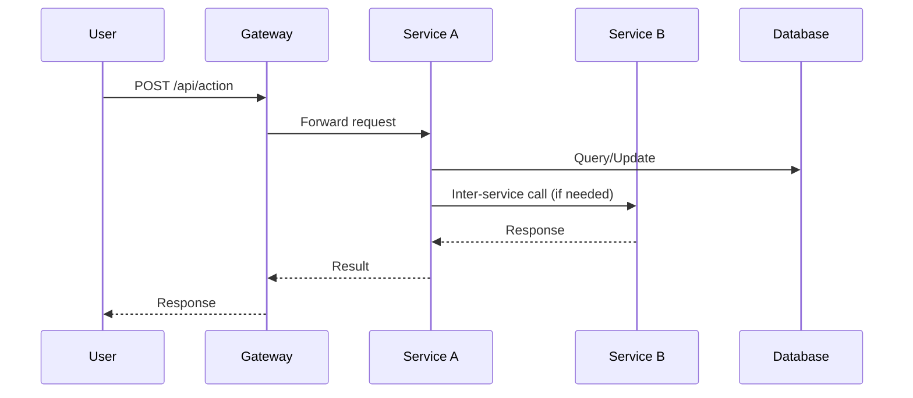

# 📊 Microservices System — Analysis and Design

This document outlines the business logic analysis and service-oriented design for a specific business process (use case) in the microservices-based system.

**References:**
1. *Service-Oriented Architecture: Analysis and Design for Services and Microservices* — Thomas Erl (2nd Edition)
2. *Microservices Patterns: With Examples in Java* — Chris Richardson
3. *Bài tập — Phát triển phần mềm hướng dịch vụ* — Hung DN (2024)

---

## 1. 🎯 Problem Statement

Describe the specific business process (use case) your system addresses:

- **Domain**: Hệ thống đặt phòng khách sạn
- **Problem**: *(What pain point does this system solve?)*
- **Users/Actors**: Customer(tìm kiếm, xem chi tiết, đặt phòng)
- **Scope**: 

---

## 2. 🧩 Service-Oriented Analysis

Analyze the business process to identify key functionalities and potential microservices.

### 2.1 Business Process Decomposition

| Step | Activity                | Actor    | Description                                                                  |
|------|-------------------------|----------|------------------------------------------------------------------------------|
| 1    | Tìm khách sạn           | Customer | Khách hàng tìm kiếm khách sạn theo địa điểm, ngày check-in và check-out      |
| 2    | Xem chi tiết khách sạn  | Customer | Khách hàng xem chi tiết khách sạn, các loại phòng, giá phòng, cơ sở vật chất |
| 3    | Chọn phòng              | Customer | Khách hàng lựa chọn phòng để tiến hành đặt phòng                             |
| 4    | Đặt phòng               | Customer | Khách hàng lựa chọn, điền thông tin cần thiết và thực hiện ấn đặt phòng      |
| 5    | Nhận thông báo qua mail | Customer | Khách hàng sau khi đặt phòng nhận được mail đơn đặt phòng được xác nhận      |


### 2.2 Entity Identification

| Entity   | Attributes                                                                                                                                    | Owned By      |
|----------|-----------------------------------------------------------------------------------------------------------------------------------------------|---------------|
| Hotel    | id, name, description, host_id, province_code, district_code, ward_code, street, is_active, longitude, latitude, created_at                   | Hotel-Service |
| RoomType | id, hotel_id,name, description, max_guests, bed_count, bed_type, base_price_per_night, has_free_cancellation, is_active, quantity, created_at | Hotel-Service |

### 2.3 Service Candidate Identification

Identify candidate services based on:
- **Business capability** decomposition
- **Domain-Driven Design** bounded contexts
- **Data ownership** boundaries

---

## 3. 🔄 Service-Oriented Design

### 3.1 Service Inventory

| Service     | Responsibility              | Type          |
|-------------|-----------------------------|---------------|
| Service A   | *(e.g., User management)*   | Entity / Task |
| Service B   | *(e.g., Order processing)*  | Entity / Task |
| Gateway     | API routing & aggregation   | Utility       |

### 3.2 Service Capabilities (Interface Design)

**Service A:**
| Capability          | Method | Endpoint        | Input              | Output            |
|---------------------|--------|-----------------|--------------------|--------------------|
| List items          | GET    | `/items`        | query params       | Item[]             |
| Create item         | POST   | `/items`        | ItemCreate body    | Item               |

**Service B:**
| Capability          | Method | Endpoint        | Input              | Output            |
|---------------------|--------|-----------------|--------------------|--------------------|
| ...                 | ...    | ...             | ...                | ...                |

### 3.3 Service Interactions

Describe the collaboration patterns:



### 3.4 Data Ownership & Boundaries

| Data Entity | Owner Service | Access Pattern          |
|-------------|---------------|-------------------------|
| ...         | Service A     | CRUD via REST API       |
| ...         | Service B     | Read via events/API     |

---

## 4. 📋 API Specifications

Complete API definitions are in:
- [`docs/api-specs/service-a.yaml`](api-specs/service-a.yaml)
- [`docs/api-specs/service-b.yaml`](api-specs/service-b.yaml)

---

## 5. 🗄️ Data Model

Describe the data model for each service:

### Service A — Data Model

```
┌─────────────────┐
│     Entity       │
├─────────────────┤
│ id: UUID         │
│ name: string     │
│ created_at: date │
└─────────────────┘
```

### Service B — Data Model

*(Add your data model here)*

---

## 6. ❗ Non-Functional Requirements

| Requirement    | Description                                         |
|----------------|-----------------------------------------------------|
| Performance    | *(e.g., < 200ms response time)*                    |
| Scalability    | *(e.g., handle 1000 concurrent users)*             |
| Availability   | *(e.g., 99.9% uptime)*                              |
| Security       | *(e.g., JWT auth, HTTPS, input validation)*        |

```
