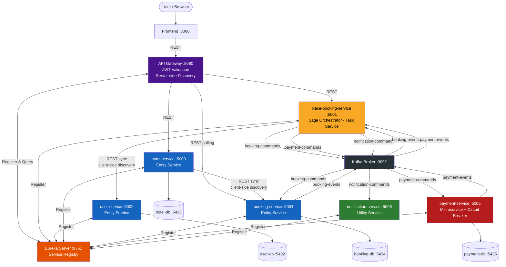
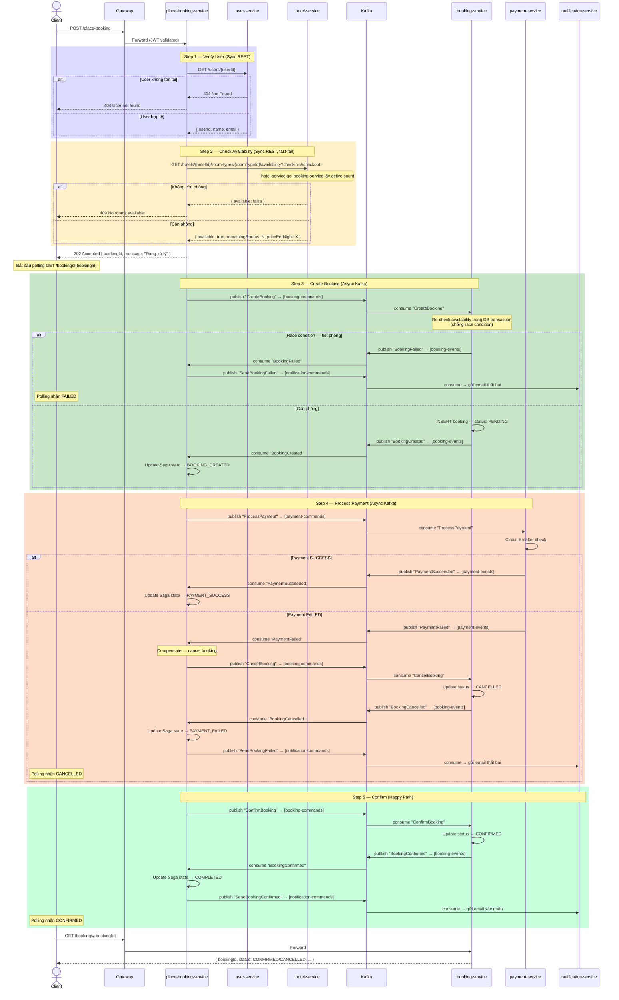

# System Architecture

> This document is completed **after** [Analysis and Design](analysis-and-design.md).
> Based on the Service Candidates and Non-Functional Requirements identified there, select appropriate architecture patterns and design the deployment architecture.

**References:**
1. *Service-Oriented Architecture: Analysis and Design for Services and Microservices* — Thomas Erl (2nd Edition)
2. *Microservices Patterns: With Examples in Java* — Chris Richardson
3. *Bài tập — Phát triển phần mềm hướng dịch vụ* — Hung Dang (available in Vietnamese)

---

## 1. Pattern Selection

| Pattern | Selected? | Business/Technical Justification |
|---------|-----------|----------------------------------|
| API Gateway | ✅ | Single entry point cho mọi request từ client. Xử lý JWT validation tập trung, routing đến đúng service, che giấu internal topology. Kết hợp với Eureka để server-side discovery. |
| Database per Service | ✅ | Mỗi service sở hữu database riêng, đảm bảo loose coupling và độc lập schema. Không service nào trực tiếp đọc DB của service khác — phải đi qua API hoặc Kafka event. |
| Shared Database | ❌ | Vi phạm service autonomy. Thay đổi schema của một service sẽ ảnh hưởng toàn bộ hệ thống — mất lợi thế deploy độc lập. |
| Saga (Orchestration) | ✅ | Luồng Place Booking gồm nhiều bước trên nhiều services. PlaceBookingService đóng vai trò Saga Orchestrator: publish Kafka commands, lắng nghe reply events, lưu Saga state, thực thi compensating transaction (cancel booking, refund) khi có bước thất bại. |
| Event-driven / Message Queue (Kafka) | ✅ | Giao tiếp bất đồng bộ giữa PlaceBookingService và các worker services (booking, payment, notification). Tăng resilience — nếu một service tạm thời down, command vẫn nằm trong Kafka topic chờ xử lý thay vì bị mất. |
| CQRS | ❌ | Không áp dụng trong scope này. Read/write pattern chưa đủ phức tạp để justify tách read model riêng. |
| Circuit Breaker | ✅ | payment-service phụ thuộc external payment gateway. Circuit Breaker (Resilience4j) ngăn cascading failure — mở circuit sau N lần timeout, trả lỗi ngay thay vì để thread pool bị block. |
| Service Registry / Discovery (Netflix Eureka) | ✅ | Tất cả services đăng ký với Eureka Server. **Server-side discovery**: Gateway query Eureka để route request, client không biết topology nội bộ. **Client-side discovery**: Internal services tự query Eureka và load balance trước khi gọi nhau qua REST. |

---

## 2. System Components

| Component | Responsibility | Tech Stack | Port |
|-----------|----------------|------------|------|
| **Frontend** | Giao diện người dùng: tìm kiếm phòng, form đặt phòng, polling trạng thái booking | React + Vite | 3000 |
| **Eureka Server** | Service Registry: nhận đăng ký từ tất cả services, cung cấp service catalog cho discovery | Spring Cloud Netflix Eureka | 8761 |
| **API Gateway** | Server-side discovery với Eureka, JWT validation, routing, CORS | Spring Cloud Gateway | 8080 |
| **place-booking-service** | Task Service — Saga Orchestrator: xác minh user (sync), publish Kafka commands, lắng nghe reply events, quản lý Saga state machine, thực thi compensating transactions | Spring Boot | 5001 |
| **user-service** | Entity Service: quản lý user profile (tên, email, thông tin liên hệ) | Spring Boot | 5002 |
| **hotel-service** | Entity Service: quản lý thông tin khách sạn, loại phòng, capacity; tính toán availability bằng cách gọi booking-service | Spring Boot | 5003 |
| **booking-service** | Entity Service: lưu trữ và quản lý booking records; cung cấp booking count cho hotel-service; cung cấp API polling trạng thái cho client | Spring Boot | 5004 |
| **payment-service** | Microservice: xử lý charge/refund qua external gateway (mock), Circuit Breaker | Spring Boot | 5005 |
| **notification-service** | Utility Service: gửi email xác nhận/huỷ phòng theo template | Spring Boot | 5006 |
| **Kafka Broker** | Message broker: trung gian bất đồng bộ giữa place-booking-service và các worker services | Apache Kafka + Zookeeper | 9092 |
| **user-db** | Database riêng cho user-service | PostgreSQL | 5432 |
| **hotel-db** | Database riêng cho hotel-service | PostgreSQL | 5433 |
| **booking-db** | Database riêng cho booking-service | PostgreSQL | 5434 |
| **payment-db** | Database riêng cho payment-service | PostgreSQL | 5435 |

---

## 3. Communication

### 3.1 Communication Styles

Hệ thống sử dụng **hai kiểu giao tiếp** với ranh giới rõ ràng:

| Kiểu | Áp dụng giữa | Lý do |
|------|-------------|-------|
| **Synchronous REST** | Client → Gateway → PlaceBookingService | Client cần nhận phản hồi ngay (202 Accepted hoặc lỗi validation/user-not-found) để hiển thị lên UI |
| **Synchronous REST** | Client → Gateway → hotel-service | Client cần data tĩnh (danh sách phòng, chi tiết khách sạn) để render UI ngay lập tức |
| **Synchronous REST** | Client → Gateway → booking-service | Client polling GET /bookings/{id} để kiểm tra trạng thái Saga sau khi nhận 202 |
| **Synchronous REST** | PlaceBookingService → user-service | Orchestrator cần xác minh user tồn tại và lấy email/tên trước khi bắt đầu Saga. Nếu user không hợp lệ → trả lỗi ngay cho client, không publish event nào |
| **Synchronous REST** | hotel-service → booking-service | hotel-service cần count booking hiện tại đồng bộ để tính availability và trả kết quả ngay cho client đang chờ |
| **Asynchronous Kafka** | PlaceBookingService ↔ booking-service | Orchestrator publish command, booking-service xử lý và reply event — decoupled, resilient với failure |
| **Asynchronous Kafka** | PlaceBookingService ↔ payment-service | Tăng resilience cho bước quan trọng nhất — payment gateway có thể chậm, không block orchestrator |
| **Asynchronous Kafka** | PlaceBookingService → notification-service | Fire & forget — gửi email là side effect, không cần đợi kết quả để tiếp tục |

### 3.2 Kafka Topics

| Topic | Publisher | Consumer | Event Types |
|-------|-----------|----------|-------------|
| `booking-commands` | place-booking-service | booking-service | `CreateBooking`, `ConfirmBooking`, `CancelBooking` |
| `booking-events` | booking-service | place-booking-service | `BookingCreated`, `BookingConfirmed`, `BookingCancelled` |
| `payment-commands` | place-booking-service | payment-service | `ProcessPayment`, `RefundPayment` |
| `payment-events` | payment-service | place-booking-service | `PaymentSucceeded`, `PaymentFailed`, `PaymentRefunded` |
| `notification-commands` | place-booking-service | notification-service | `SendBookingConfirmed`, `SendBookingFailed` |

### 3.3 Service Discovery

| Scenario | Pattern | Cơ chế hoạt động |
|----------|---------|-----------------|
| Client → API Gateway | **Server-side Discovery** | Client chỉ biết địa chỉ Gateway. Gateway đăng ký với Eureka và query Eureka để tìm instance của service đích, tự load balance. Client không cần biết topology nội bộ. |
| Internal service → service (REST) | **Client-side Discovery** | Service (e.g. hotel-service gọi booking-service) tự query Eureka lấy danh sách instances, dùng Spring Cloud LoadBalancer để chọn instance và gọi trực tiếp. |
| Kafka communication | N/A | Kafka broker address cấu hình tĩnh trong `.env` — Kafka là infrastructure, không phải application service cần discovery. |

### 3.4 Inter-service Communication Matrix

| From → To | place-booking | user-service | hotel-service | booking-service | payment-service | notification-service | Gateway |    Kafka     |
|-----------|:-------------:|:---:|:-------------:|:---:|:---------------:|:--------------------:|:---:|:------------:|
| **Frontend** |               | |               | |                 |                      | REST |              |
| **API Gateway** |     REST      | REST |     REST      | REST |                 |                      | |              |
| **place-booking-service** |               | REST sync |   REST sync    | Kafka |      Kafka      |        Kafka         | |   pub/sub    |
| **hotel-service** |   REST sync   | |               | REST sync |                 |                      | |              |
| **booking-service** |     Kafka     | |               | |                 |                      | |   pub/sub    |
| **payment-service** |     Kafka     | |               | |                 |                      | |   pub/sub    |
| **notification-service** |               | |               | |                 |                      | |     sub      |

> **payment-service và notification-service không expose qua Gateway** — chỉ tiếp nhận lệnh qua Kafka từ orchestrator. Đảm bảo mọi luồng đặt phòng đều đi qua Saga, không ai bypass được business logic.

---

## 4. Architecture Diagram



**Chú thích:**
- 🟡 **Vàng** — Task Service (Saga Orchestrator)
- 🔵 **Xanh dương** — Entity Service (Agnostic)
- 🔴 **Đỏ** — Microservice (isolated vì NFR)
- 🟢 **Xanh lá** — Utility Service
- 🟣 **Tím** — API Gateway
- 🟠 **Cam** — Eureka Service Registry
- ⚫ **Đen** — Kafka Broker

---

## 5. Saga Flow — Place Booking (Async Orchestration qua Kafka)

PlaceBookingService lưu **Saga state** trong DB của mình để track tiến trình qua các bước async. Client dùng **polling** để biết kết quả cuối cùng.




---

## 6. Deployment

- Tất cả services containerize bằng Docker
- Orchestrate bằng Docker Compose — single command: `docker compose up --build`
- Services giao tiếp nội bộ qua Docker Compose DNS (tên service, không dùng `localhost`)

```bash
docker compose up --build

# Verify
curl http://localhost:8761                 # Eureka Dashboard
curl http://localhost:8080/actuator/health # API Gateway
curl http://localhost:5001/health          # place-booking-service
curl http://localhost:5002/health          # user-service
curl http://localhost:5003/health          # hotel-service
curl http://localhost:5004/health          # booking-service
curl http://localhost:5005/health          # payment-service
curl http://localhost:5006/health          # notification-service
```

### Startup Order (Docker Compose depends_on)

```
1. Zookeeper
2. Kafka broker          ← depends on: Zookeeper
3. Eureka Server         ← depends on: (none)
4. Databases             ← user-db, hotel-db, booking-db, payment-db
5. user-service          ← depends on: Eureka, user-db
   hotel-service         ← depends on: Eureka, hotel-db
   booking-service       ← depends on: Eureka, booking-db, Kafka
   payment-service       ← depends on: Eureka, payment-db, Kafka
   notification-service  ← depends on: Eureka, Kafka
6. place-booking-service ← depends on: Eureka, Kafka, tất cả services trên
7. API Gateway           ← depends on: Eureka
8. Frontend              ← depends on: API Gateway
```
