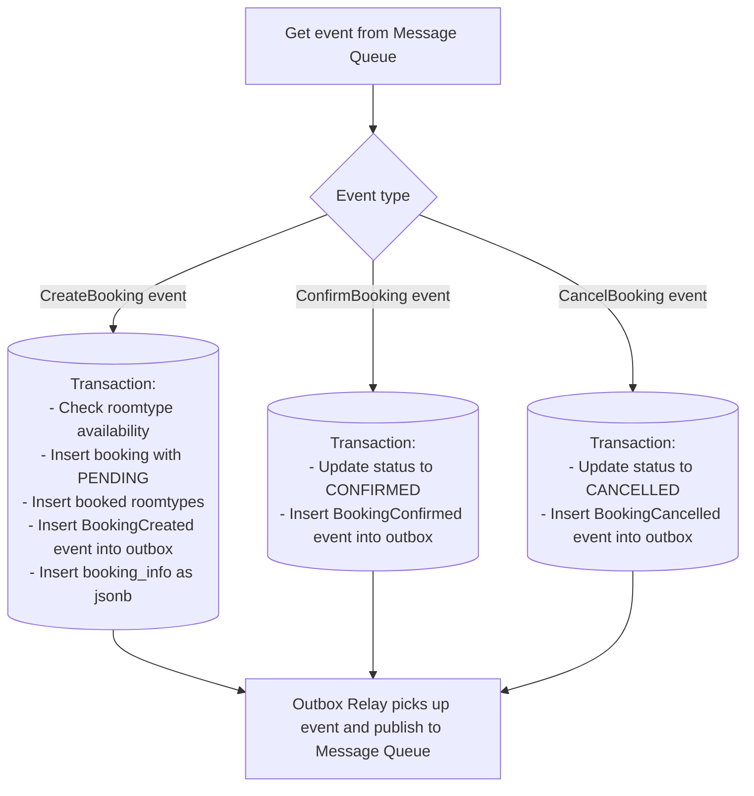

# Booking Service

## Overview

**Booking Service** là Entity Service (Agnostic) chịu trách nhiệm lưu trữ và quản lý toàn bộ vòng đời của đơn đặt phòng.

- **Business domain**: Quản lý booking records, trạng thái đơn đặt phòng, chi tiết phòng được đặt
- **Data ownership**: Sở hữu toàn bộ dữ liệu về `bookings`, `booked_roomtypes`, `outbox_events`
- **Vai trò trong hệ thống**:
  - Nhận Kafka commands từ `PlaceBookingService` (orchestrator) để tạo/xác nhận/huỷ booking
  - Publish Kafka events kết quả qua **Outbox Pattern** (đảm bảo không mất event khi service crash)
  - Cung cấp `GET /bookings/count` cho `hotel-service` để tính room availability
  - Cung cấp `GET /bookings/{id}` cho client polling trạng thái Saga

## Tech Stack


| Component         | Choice                                        |
| ----------------- | --------------------------------------------- |
| Language          | Java 21                                       |
| Framework         | Spring Boot 3.5.13                            |
| Database          | PostgreSQL                                    |
| Messaging         | Apache Kafka (consumer + producer qua Outbox) |
| Service Discovery | Spring Cloud Netflix Eureka Client            |


## API Endpoints


| Method | Endpoint                       | Description                                                                                                                      |
| ------ | ------------------------------ | -------------------------------------------------------------------------------------------------------------------------------- |
| GET    | `/health`                      | Health check — trả về `{"status": "ok"}`                                                                                         |
| GET    | `/bookings/count`              | Đếm active bookings theo roomTypeId + date range (dùng nội bộ bởi hotel-service)                                                 |
| GET    | `/bookings/{bookingId}`        | Lấy chi tiết booking — client dùng để polling, lấy jsonb booking_detail từ bảng booking_info và status ở bảng booking cho client |
| PATCH  | `/bookings/{bookingId}/status` | Cập nhật trạng thái booking                                                                                                      |


> Full API specification: `[docs/api-specs/booking-service.yaml](../../docs/api-specs/booking-service.yaml)`

## Database Schema

### Enum Types


| Enum                  | Values      | Mô tả                                                             |
| --------------------- | ----------- | ----------------------------------------------------------------- |
| `booking_status_enum` | `FAILED`    | Đơn đặt phòng không tạo thành công sau khi check lại availibility |
|                       | `PENDING`   | Phòng đang được giữ chỗ, chờ thanh toán tiền cọc                  |
|                       | `CONFIRMED` | Đã thanh toán tiền cọc, booking được xác nhận                     |
|                       | `CANCELLED` | Không thanh toán được trong thời hạn, đơn bị huỷ                  |
|                       | `CHECKEDIN` | Khách hàng đã check-in                                            |
|                       | `COMPLETED` | Khách đã thanh toán đầy đủ, check-out, đơn hoàn thành             |
| `payment_method_enum` | `BANKING`   | Thanh toán qua tài khoản ngân hàng                                |
|                       | `E-WALLET`  | Thanh toán qua ví điện tử                                         |


### `bookings` — Đơn đặt phòng


| Field             | Datatype            | Constraint        | Description                         |
| ----------------- | ------------------- | ----------------- | ----------------------------------- |
| `id`              | varchar(255)        | PRIMARY KEY       | UUID có prefix (ví dụ: `BK-123abc`) |
| `customer_id`     | varchar(255)        | NOT NULL          | ID khách hàng                       |
| `hotel_id`        | varchar(255)        | NOT NULL          | ID khách sạn                        |
| `created_at`      | timestamptz         | DEFAULT NOW()     | Thời gian tạo booking               |
| `checkin_date`    | date                | NOT NULL          | Ngày check-in                       |
| `checkout_date`   | date                | NOT NULL          | Ngày check-out                      |
| `num_adults`      | integer             | NOT NULL          | Số người lớn                        |
| `total_amount`    | numeric             | NOT NULL          | Tổng tiền                           |
| `currency`        | varchar(255)        | DEFAULT 'VND'     | Đơn vị tiền tệ                      |
| `status`          | booking_status_enum | DEFAULT 'PENDING' | Trạng thái đơn                      |
| `payment_method`  | payment_method_enum |                   | Phương thức thanh toán              |
| `idempotency_key` | varchar(255)        | UNIQUE            | Đảm bảo không tạo booking trùng lặp |


### `booked_roomtypes` — Chi tiết phòng trong booking


| Field             | Datatype     | Constraint                 | Description                         |
| ----------------- | ------------ | -------------------------- | ----------------------------------- |
| `id`              | varchar(255) | PRIMARY KEY                | UUID có prefix (ví dụ: `BR-123abc`) |
| `booking_id`      | varchar(255) | NOT NULL, FK → bookings.id | ID booking                          |
| `room_type_id`    | varchar(255) | NOT NULL                   | ID loại phòng được đặt              |
| `quantity`        | integer      | NOT NULL                   | Số lượng phòng đặt                  |
| `price_per_night` | numeric      | NOT NULL                   | Giá mỗi đêm tại thời điểm đặt       |
| `nights`          | integer      | NOT NULL                   | Số đêm                              |
| `subtotal`        | numeric      | NOT NULL                   | Tổng tiền cho loại phòng này        |


### `booking_info` - View tổng hợp thông tin booking (dùng cho API response và gửi notification)


| Field            | Datatype     | Constraint                     | Description                 |
| ---------------- | ------------ | ------------------------------ | --------------------------- |
| `booking_id`     | varchar(255) | Primary key, FK -> bookings.id | ID booking                  |
| `booking_detail` | jsonb        | NOT NULL                       | json chứa thông tin booking |


### `outbox_events` — Outbox Pattern

Bảng này là trung tâm của **Outbox Pattern** — đảm bảo không mất Kafka event khi service crash giữa chừng.
Mỗi khi booking được tạo/cập nhật, một event được INSERT vào bảng này **trong cùng DB transaction** với business data.
`OutboxRelay` (scheduled task, chạy mỗi 100 ms) đọc các event chưa publish và gửi lên Kafka.


| Field          | Datatype     | Constraint                             | Description                               |
| -------------- | ------------ | -------------------------------------- | ----------------------------------------- |
| `id`           | uuid         | PRIMARY KEY, DEFAULT gen_random_uuid() | ID tự sinh                                |
| `topic`        | varchar(100) | NOT NULL                               | Tên Kafka topic (ví dụ: `booking-events`) |
| `payload`      | jsonb        | NOT NULL                               | Nội dung event dạng JSON                  |
| `published`    | boolean      | DEFAULT false                          | Đã publish lên Kafka chưa                 |
| `created_at`   | timestamp    | DEFAULT NOW()                          | Thời gian tạo event                       |
| `published_at` | timestamp    |                                        | Thời gian publish thành công              |


## Kafka Integration

### Topics consumed (lắng nghe lệnh từ PlaceBookingService)


| Topic              | Event Type       | Xử lý                                           |
| ------------------ | ---------------- | ----------------------------------------------- |
| `booking-commands` | `CreateBooking`  | Insert booking PENDING + insert outbox event    |
| `booking-commands` | `ConfirmBooking` | Update status → CONFIRMED + insert outbox event |
| `booking-commands` | `CancelBooking`  | Update status → CANCELLED + insert outbox event |


### Topics produced (qua Outbox Relay)


| Topic            | Event Type         | Trigger                        |
| ---------------- | ------------------ | ------------------------------ |
| `booking-events` | `BookingFailed`    | Sau khi tạo booking thất bại   |
| `booking-events` | `BookingCreated`   | Sau khi tạo booking thành công |
| `booking-events` | `BookingConfirmed` | Sau khi confirm booking        |
| `booking-events` | `BookingCancelled` | Sau khi cancel booking         |


## Running Locally

```bash
# Chạy toàn bộ hệ thống từ project root
docker compose up --build

# Chỉ chạy service này (và dependencies)
docker compose up booking-service booking-db kafka zookeeper --build
```

## Project Structure

```
booking-service/
├── Dockerfile
├── readme.md
└── src/
    └── main/
        ├── java/com/hotelbooking/bookingservice/
        │   ├── controller/     # REST controllers
        │   ├── service/        # Business logic
        │   ├── repository/     # JPA repositories
        │   ├── entity/         # JPA entities (Booking, BookedRoom, OutboxEvent)
        │   ├── dto/            # Request/Response DTOs
        │   ├── kafka/
        │   │   ├── consumer/   # @KafkaListener xử lý booking-commands
        │   │   └── relay/      # OutboxRelay (@Scheduled, publish booking-events)
        │   └── enums/          # BookingStatus, PaymentMethod
        └── resources/
            └── application.properties
```

## Environment Variables


| Variable                  | Description             | Default                            |
| ------------------------- | ----------------------- | ---------------------------------- |
| `SERVER_PORT`             | Port nội bộ của service | `5000`                             |
| `DB_HOST`                 | Hostname của PostgreSQL | `booking-db`                       |
| `DB_PORT`                 | Port PostgreSQL nội bộ  | `5432`                             |
| `DB_NAME`                 | Tên database            | `booking_db`                       |
| `DB_USER`                 | Username PostgreSQL     | `postgres`                         |
| `DB_PASSWORD`             | Password PostgreSQL     | *(required)*                       |
| `EUREKA_ENABLED`          | Bật/tắt Eureka client   | `false`                            |
| `EUREKA_SERVER_URL`       | URL Eureka Server       | `http://eureka-server:8761/eureka` |
| `KAFKA_BOOTSTRAP_SERVERS` | Kafka broker address    | `kafka:9092`                       |
| `KAFKA_CONSUMER_GROUP`    | Consumer group ID       | `booking-service-group`            |
| `OUTBOX_RELAY_INTERVAL_MS`| Chu kỳ relay outbox (ms)| `100`                              |


## Events Payload

1. CreateBooking command:

```yaml
    Payload:
      type: object
      required: [eventType, user, hotel, bookingId, roomTypeList, checkin, checkout,numAdults, totalAmount, currency, paymentMethod, paymentToken]
      properties:
        sagaId:
          type: string
          format: uuid
          example: 550e8400-e29b-41d4-a716-446655440000
        eventType:
          type: string
          enum: [CreateBooking, ConfirmBooking, CancelBooking]
          example: CreateBooking
        user:
          type: object
          properties:
            userId:
              type: string
              example: US-001
            name:
              type: string
              example: Nguyen Van A
            email:
              type: string
              format: email
              example: nva@gmail.com
        hotel:
          type: object
          properties:
            hotelId: 
              type: string
              example: HT-001
            name:
              type: string
              example: Hotel ABC
            address:
              type: string
              example: Ha Dong, Ha Noi              
        bookingId:
          type: string
          format: uuid
          example: bk-550e8400
        roomTypeList:
          type: array
          items:
            type: object
            properties:
              roomTypeId:
                type: string
                format: uuid
              name: 
                type: string
                example: Deluxe
              bedCount:
                type: integer
                example: 2
              bookingQuantity:
                type: integer
                example: 1
              totalQuantity:
                type: integer
                example: 10
              price:
                type: number
                format: double
                example: 1000000
        checkin:
          type: string
          format: date
        checkout:
          type: string
          format: date
        numAdults:
          type: integer
          example: 2
        totalAmount:
          type: number
          format: double
          example: 1000000
        currency:
          type: string
          example: VND
        paymentMethod:
          type: string
          enum: [CREDIT_CARD]
          example: CREDIT_CARD
        paymentToken:
          type: string
          example: pi_1J2Y3Z4A5B6C7D8E9F0G
```

1. ConfirmBooking command:

```yaml
    Payload:
      type: object
      required: [eventType, bookingId]
      properties:
        sagaId:
          type: string
          format: uuid
          example: 550e8400-e29b-41d4-a716-446655440000
        eventType:
          type: string
          enum: [CreateBooking, ConfirmBooking, CancelBooking]
          example: ConfirmBooking
        bookingId:
          type: string
          format: uuid
          example: bk-550e8400
```

1. CancelBooking command:

```yaml
    Payload:
      type: object
      required: [eventType, bookingId]
      properties:
        sagaId:
          type: string
          format: uuid
          example: 550e8400-e29b-41d4-a716-446655440000
        eventType:
          type: string
          enum: [CreateBooking, ConfirmBooking, CancelBooking]
          example: CancelBooking
        bookingId:
          type: string
          format: uuid
          example: bk-550e8400
```

1. BookingCreated event:

```yaml
    Payload:
      type: object
      required: [eventType, bookingId, userId, totalAmount, currency,paymentMethod, paymentToken]
      properties:
        sagaId:
          type: string
          format: uuid
          example: 550e8400-e29b-41d4-a716-446655440000
        eventType:
          type: string
          enum: [BookingCreated, BookingFailed, BookingConfirmed, BookingCancelled]
          example: BookingCreated
        bookingId:
          type: string
          format: uuid
          example: bk-550e8400
        userId:
          type: string
          example: US-001
        totalAmount:
          type: number
          format: double
          example: 1000000
        currency:
          type: string
          example: VND
        paymentMethod:
          type: string
          enum: [CREDIT_CARD]
          example: CREDIT_CARD
        paymentToken:
          type: string
          example: pi_1J2Y3Z4A5B6C7D
```

1. BookingFailed event:

```yaml
    Payload:
      type: object
      required: [eventType, bookingId, user, reason]
      properties:
        sagaId:
          type: string
          format: uuid
          example: 550e8400-e29b-41d4-a716-446655440000
        eventType:
          type: string
          enum: [BookingCreated, BookingFailed, BookingConfirmed, BookingCancelled]
          example: BookingFailed
        booking: # this booking is the info view to send to notification service
          type: object
          properties:
            bookingId:  
            type: string
            format: uuid
            example: bk-550e8400
            customer:
              type: object
              properties:
                name:
                  type: string
                  example: Nguyen Van A
                email:
                  type: string
                  format: email
                  example: nva@gmail.com
            checkin:
              type: string
              format: date
            checkout:
              type: string
              format: date
            numAdults:
              type: integer
              example: 2
            totalAmount:
              type: number
              format: double
            hotel:
              type: object
              properties:
                name:
                  type: string
                  example: Hotel ABC
                address:
                  type: string
                  example: Ha Dong, Ha Noi
            roomTypeList:
              type: array
              items:
                type: object
                properties:
                  name: 
                    type: string
                    example: Deluxe
                  bedCount:
                    type: integer
                    example: 2
                  bookingQuantity:
                    type: integer
                    example: 1
                  price:
                    type: number
                    format: double
                    example: 1000000
        reason:
          type: string
          example: "Room not available"
```

1. BookingConfirmed event:

```yaml
    Payload:
      type: object
      required: [eventType, booking]
      properties:
        sagaId:
          type: string
          format: uuid
          example: 550e8400-e29b-41d4-a716-446655440000
        eventType:
          type: string
          enum: [BookingCreated, BookingFailed, BookingConfirmed, BookingCancelled]
          example: BookingConfirmed
        booking: # this booking is the info view to send to notification service, this is the dto to save in booking_info table as jsonb
          type: object
          properties:
            bookingId:
            type: string
            format: uuid
            example: bk-550e8400
            customer:
              type: object
              properties:
                name:
                  type: string
                  example: Nguyen Van A
                email:
                  type: string
                  format: email
                  example: nva@gmail.com
            checkin:
              type: string
              format: date
            checkout:
              type: string
              format: date
            numAdults:
              type: integer
              example: 2
            totalAmount:
              type: number
              format: double
            hotel:
              type: object
              properties:
                name:
                  type: string
                  example: Hotel ABC
                address:
                  type: string
                  example: Ha Dong, Ha Noi
            roomTypeList:
              type: array
              items:
                type: object
                properties:
                  name:
                    type: string
                    example: Deluxe
                  bedCount:
                    type: integer
                    example: 2
                  bookingQuantity:
                    type: integer
                    example: 1
                  price:
                    type: number
                    format: double
                    example: 1000000
```

1. BookingCancelled event:

```yaml
    Payload:
      type: object
      required: [eventType, booking, reason]
      properties:
        sagaId:
          type: string
          format: uuid
          example: 550e8400-e29b-41d4-a716-446655440000
        eventType:
          type: string
          enum: [BookingCreated, BookingFailed, BookingConfirmed, BookingCancelled]
          example: BookingCancelled
        booking: # this booking is the info view to send to notification service, this is the dto to save in booking_info table as jsonb
          type: object
          properties:
            bookingId:  
            type: string
            format: uuid
            example: bk-550e8400
            customer:
              type: object
              properties:
                name:
                  type: string
                  example: Nguyen Van A
                email:
                  type: string
                  format: email
                  example: nva@gmail.com
            checkin:
              type: string
              format: date
            checkout:
              type: string
              format: date
            numAdults:
              type: integer
              example: 2
            totalAmount:
              type: number
              format: double
            hotel:
              type: object
              properties:
                name:
                  type: string
                  example: Hotel ABC
                address:
                  type: string
                  example: Ha Dong, Ha Noi
            roomTypeList:
              type: array
              items:
                type: object
                properties:
                  name: 
                    type: string
                    example: Deluxe
                  bedCount:
                    type: integer
                    example: 2
                  bookingQuantity:
                    type: integer
                    example: 1
                  price:
                    type: number
                    format: double
                    example: 1000000
        reason:
          type: string
          example: "Payment failed"
```

### Service workflow




### CreateBooking transaction

1. Check availability: (đoạn này cần xử lý lock row để tránh race condition)
  - so sánh số booking pending, confirmed có cùng roomtypeid và overlaps checkin-checkout cộng bookingQuantity (số room muốn đặt) và totalQuantity trong roomtypeList tương ứng của event CreateBooking payload
  - nếu chỉ cần 1 roomtype không đủ thì fail toàn bộ booking, insert 1 BookingFailed event vào outbox với reason là "Room {roomtype_name} not available"
  - nếu đủ thì tiếp tục bước 2
2. Insert booking với status = PENDING
3. Insert booked roomtypes tương ứng với bookingId vừa tạo
4. Insert 1 BookingCreated event vào outbox với payload chứa bookingId, userId
5. Insert booking_info với bookingId và booking_detail (jsonb chứa toàn bộ thông tin booking để gửi notification)

